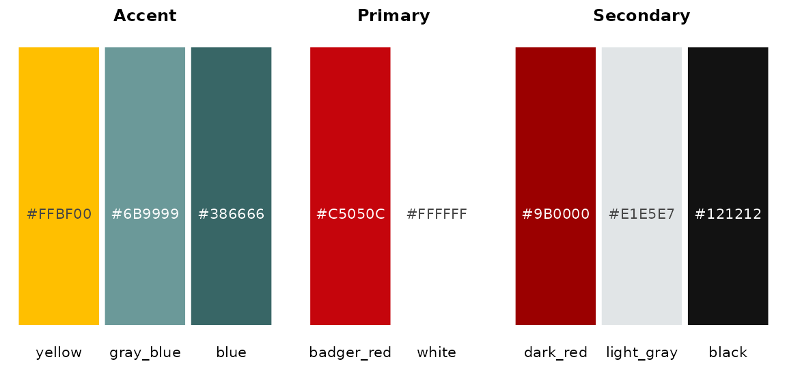
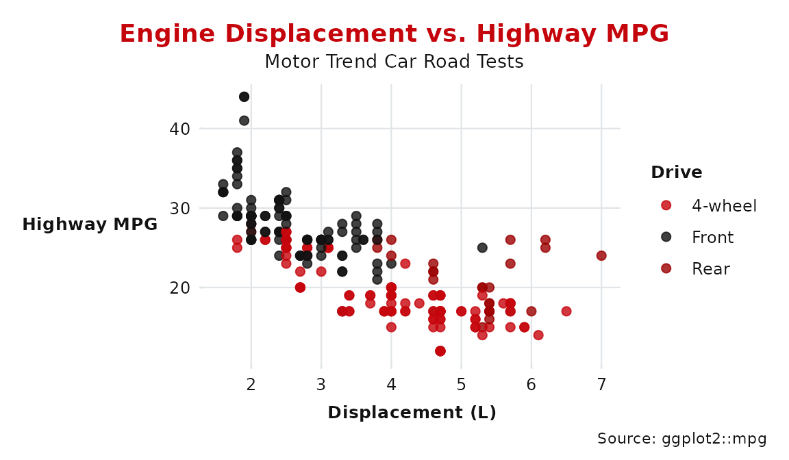
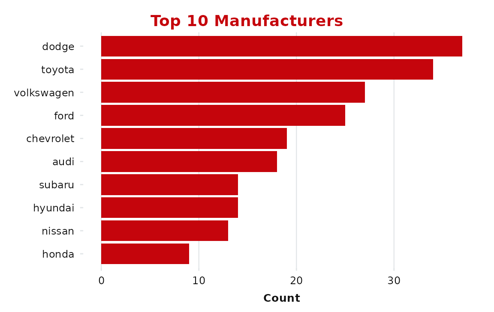
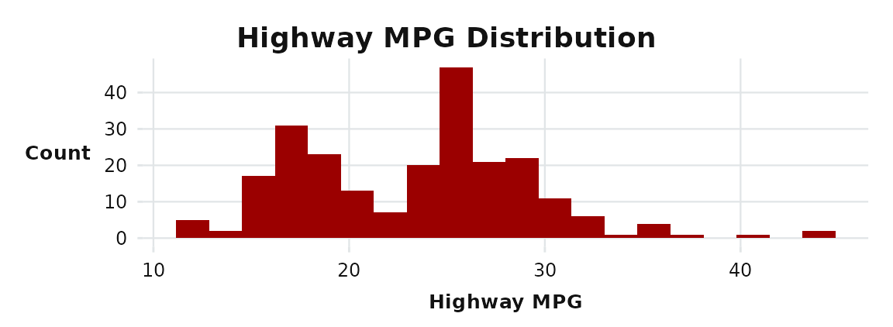
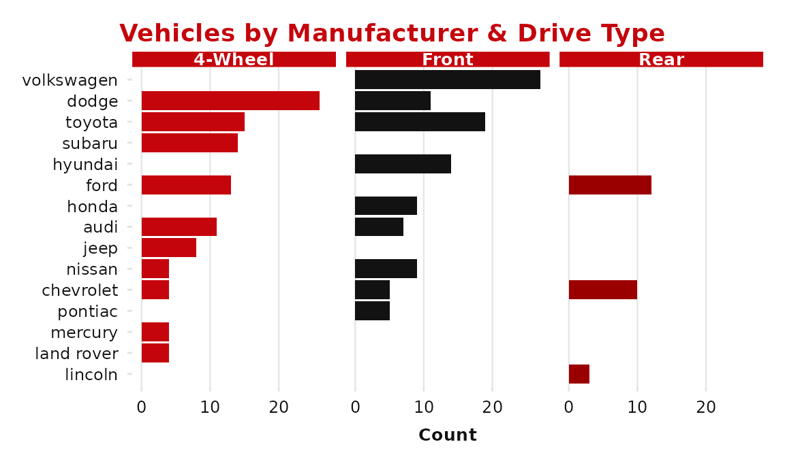
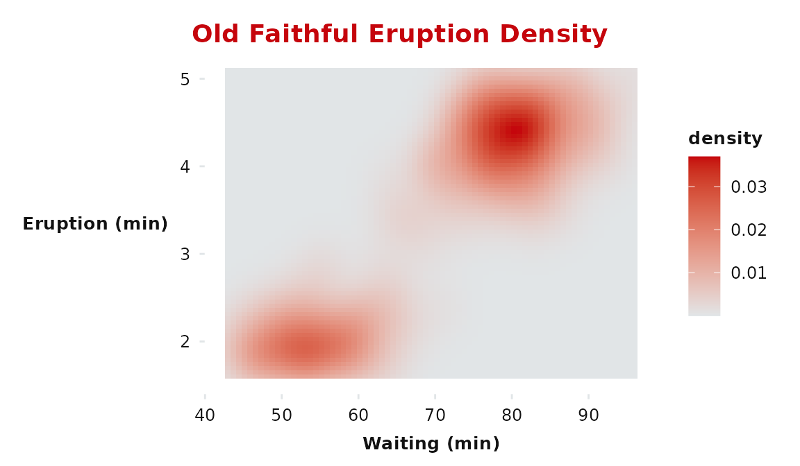
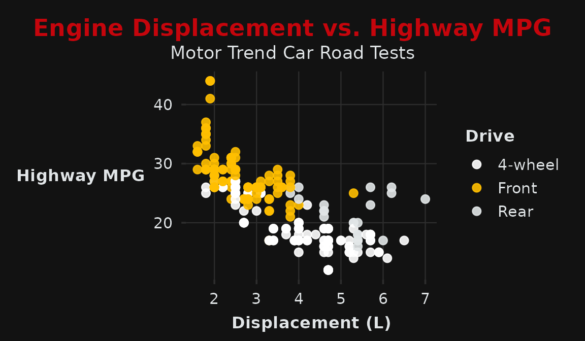
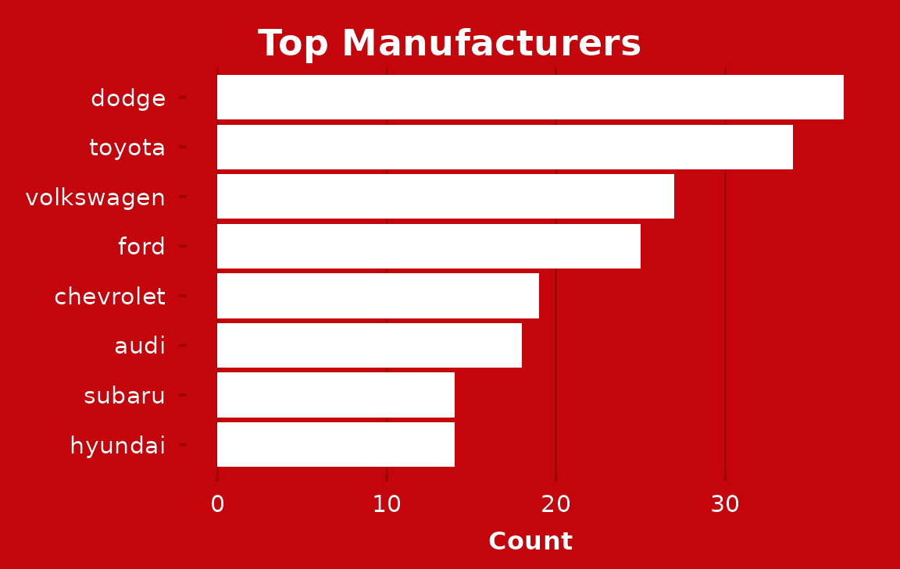
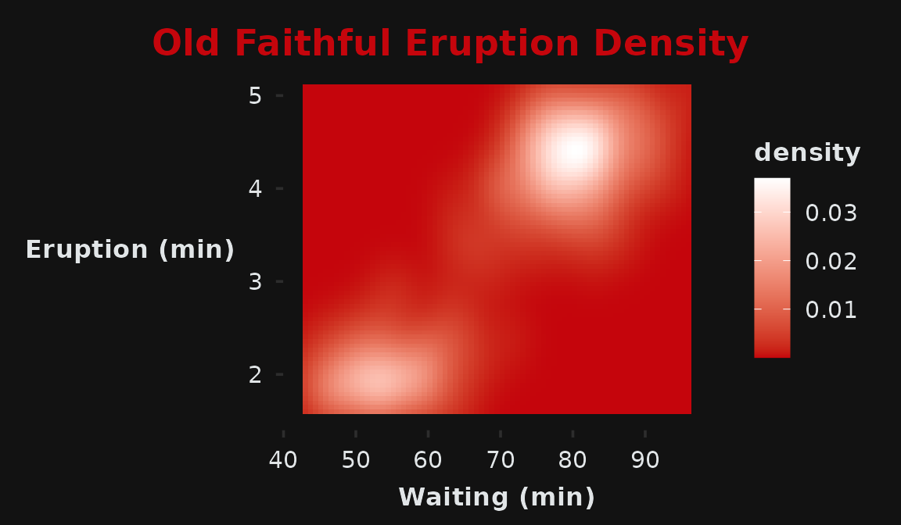

# Getting Started with uwbranding

The **uwbranding** package provides ggplot2 themes, color palettes, and
Quarto document templates that conform to the [UW–Madison brand
identity](https://brand.wisc.edu/).

``` r

library(uwbranding)
#> uwbranding: UW–Madison brand identity for R and Quarto.
#> Fonts required: Crimson Pro, Red Hat Display, Red Hat Text
#> Download: https://brand.wisc.edu/visual-identity/typography/
library(ggplot2)
library(dplyr)
#> 
#> Attaching package: 'dplyr'
#> The following objects are masked from 'package:stats':
#> 
#>     filter, lag
#> The following objects are masked from 'package:base':
#> 
#>     intersect, setdiff, setequal, union
```

> **Note on fonts.** The brand themes use Crimson Pro, Red Hat Display,
> and Red Hat Text. If these aren’t installed as system fonts, ggplot2
> will fall back to its default — the themes will still work, but
> typography won’t match the brand. Download links are at
> <https://brand.wisc.edu/visual-identity/typography/>.

------------------------------------------------------------------------

## Brand colors

All official colors are in the named vector `uw_colors`. Use
[`uw_color()`](https://cdmuir.github.io/uwbranding/reference/uw_color.md)
to retrieve specific values by name.

``` r

uw_colors
#> badger_red      white   dark_red light_gray      black     yellow  gray_blue 
#>  "#C5050C"  "#FFFFFF"  "#9B0000"  "#E1E5E7"  "#121212"  "#FFBF00"  "#6B9999" 
#>       blue 
#>  "#386666"
```

``` r

uw_color("badger_red")
#> badger_red 
#>  "#C5050C"
uw_color("badger_red", "dark_red", "light_gray")
#> badger_red   dark_red light_gray 
#>  "#C5050C"  "#9B0000"  "#E1E5E7"
```

Here they are at a glance:



------------------------------------------------------------------------

## Light theme

[`theme_uw()`](https://cdmuir.github.io/uwbranding/reference/theme_uw.md)
is the default theme for PDF documents and light-background slides. It
pairs Badger Red headings with a clean white panel.

``` r

ggplot(mpg, aes(x = displ, y = hwy, color = drv)) +
  geom_point(size = 2, alpha = 0.8) +
  scale_color_uw(labels = c("4-wheel", "Front", "Rear")) +
  labs(
    title    = "Engine Displacement vs. Highway MPG",
    subtitle = "Motor Trend Car Road Tests",
    x        = "Displacement (L)",
    y        = "Highway MPG",
    color    = "Drive",
    caption  = "Source: ggplot2::mpg"
  ) +
  theme_uw()
```



The `grid` argument controls which gridlines are shown (`"both"`, `"x"`,
`"y"`, `"none"`). For bar charts, `grid = "x"` is usually cleaner.

``` r

mpg |>
  count(manufacturer) |>
  slice_max(n, n = 10) |>
  ggplot(aes(x = n, y = reorder(manufacturer, n))) +
  geom_col(fill = uw_color("badger_red")) +
  labs(title = "Top 10 Manufacturers", x = "Count", y = NULL) +
  theme_uw(grid = "x")
```



`title_color` accepts any color name from `uw_colors` or a raw hex
string — useful when Badger Red doesn’t contrast enough against your
content:

``` r

ggplot(mpg, aes(x = hwy)) +
  geom_histogram(fill = uw_color("dark_red"), bins = 20) +
  labs(title = "Highway MPG Distribution", x = "Highway MPG", y = "Count") +
  theme_uw(title_color = "black")
```



------------------------------------------------------------------------

## Color scales

### Discrete (light)

[`scale_color_uw()`](https://cdmuir.github.io/uwbranding/reference/scale_color_uw.md)
and
[`scale_fill_uw()`](https://cdmuir.github.io/uwbranding/reference/scale_fill_uw.md)
apply \[uw_palette_discrete\] — ordered for visibility on white:

``` r

mpg |>
  count(manufacturer, drv) |>
  ggplot(aes(x = n, y = reorder(manufacturer, n), fill = drv)) +
  geom_col() +
  scale_fill_uw(labels = c("4-wheel", "Front", "Rear")) +
  facet_wrap(~drv, labeller = as_labeller(
    c(`4` = "4-Wheel", f = "Front", r = "Rear")
  )) +
  labs(title = "Vehicles by Manufacturer & Drive Type",
       x = "Count", y = NULL) +
  theme_uw(grid = "x") +
  theme(legend.position = "none")
```



### Continuous (light)

[`scale_fill_uw_c()`](https://cdmuir.github.io/uwbranding/reference/scale_color_uw_c.md)
and
[`scale_color_uw_c()`](https://cdmuir.github.io/uwbranding/reference/scale_color_uw_c.md)
run from UW Light Gray to Badger Red:

``` r

ggplot(faithfuld, aes(waiting, eruptions, fill = density)) +
  geom_tile() +
  scale_fill_uw_c() +
  labs(title = "Old Faithful Eruption Density",
       x = "Waiting (min)", y = "Eruption (min)") +
  theme_uw(grid = "none")
```



------------------------------------------------------------------------

## Dark theme

[`theme_uw_dark()`](https://cdmuir.github.io/uwbranding/reference/theme_uw_dark.md)
is designed for slides and poster panels. Two styles are available via
the `style` argument.

### `style = "black"` (default)

Near-black background (`#121212`) with a Badger Red title — the most
versatile dark option.

``` r

ggplot(mpg, aes(x = displ, y = hwy, color = drv)) +
  geom_point(size = 2.5, alpha = 0.9) +
  scale_color_uw_dark(labels = c("4-wheel", "Front", "Rear")) +
  labs(
    title    = "Engine Displacement vs. Highway MPG",
    subtitle = "Motor Trend Car Road Tests",
    x        = "Displacement (L)",
    y        = "Highway MPG",
    color    = "Drive"
  ) +
  theme_uw_dark()
```



### `style = "red"`

Badger Red background (`#C5050C`) with white text — high-impact title
slides and poster headers.

``` r

mpg |>
  count(manufacturer) |>
  slice_max(n, n = 8) |>
  ggplot(aes(x = n, y = reorder(manufacturer, n))) +
  geom_col(fill = "white") +
  labs(title = "Top Manufacturers", x = "Count", y = NULL) +
  theme_uw_dark(style = "red", grid = "x")
```



### Continuous (dark)

[`scale_fill_uw_dark_c()`](https://cdmuir.github.io/uwbranding/reference/scale_color_uw_dark_c.md)
runs Badger Red → White, suited to dark panels:

``` r

ggplot(faithfuld, aes(waiting, eruptions, fill = density)) +
  geom_tile() +
  scale_fill_uw_dark_c() +
  labs(title = "Old Faithful Eruption Density",
       x = "Waiting (min)", y = "Eruption (min)") +
  theme_uw_dark(grid = "none")
```



------------------------------------------------------------------------

## Quarto templates

[`use_uw_pdf()`](https://cdmuir.github.io/uwbranding/reference/use_uw.md),
[`use_uw_revealjs()`](https://cdmuir.github.io/uwbranding/reference/use_uw.md),
and
[`use_uw_beamer()`](https://cdmuir.github.io/uwbranding/reference/use_uw.md)
copy starter templates into any project directory. Run them once per
project, then render normally with `quarto render`.

``` r

# PDF document (copies uw-brand.tex, _quarto.yml, template.qmd)
use_uw_pdf()

# RevealJS presentation (copies _uw-light.scss, _uw-dark.scss, template.qmd)
use_uw_revealjs()

# Beamer/PDF presentation (copies _uw-beamer-preamble.tex, title.tex, template.qmd)
use_uw_beamer()

# All three default to getwd(). Use path = to target a subdirectory.
use_uw_revealjs(path = "slides")

# Use overwrite = TRUE to refresh files from the package.
use_uw_pdf(overwrite = TRUE)
```

### File inventory

| Function | Files copied |
|----|----|
| [`use_uw_pdf()`](https://cdmuir.github.io/uwbranding/reference/use_uw.md) | `uw-brand.tex`, `_quarto.yml`, `template.qmd` |
| [`use_uw_revealjs()`](https://cdmuir.github.io/uwbranding/reference/use_uw.md) | `_uw-light.scss`, `_uw-dark.scss`, `template.qmd` |
| [`use_uw_beamer()`](https://cdmuir.github.io/uwbranding/reference/use_uw.md) | `_uw-beamer-preamble.tex`, `title.tex`, `template.qmd` |

------------------------------------------------------------------------

## Switching light ↔︎ dark

The light and dark versions of each format are designed to be toggled
with minimal changes.

### RevealJS

In the YAML front matter, swap the theme line:

``` yaml
# Light:
theme: [default, _uw-light.scss]

# Dark:
theme: [default, _uw-dark.scss]
```

In the setup chunk, match the plot theme:

``` r

theme_set(theme_uw(base_size = 14))       # light
theme_set(theme_uw_dark(base_size = 14))  # dark
```

### Beamer

In `_uw-beamer-preamble.tex`, flip one line:

``` latex
\uwdarkfalse   % light (default)
\uwdarktrue    % dark
```

Match the plot theme in the setup chunk (use `base_size = 9` for
Beamer):

``` r

theme_set(theme_uw(base_size = 9))       # light
theme_set(theme_uw_dark(base_size = 9))  # dark
```

### Consistent plot theming across a document

Set the theme once in a setup chunk so all subsequent plots inherit it:

``` r

library(uwbranding)
theme_set(theme_uw())   # or theme_uw_dark()
```

Individual plots can still override with
`+ theme_uw_dark(style = "red")` etc.
